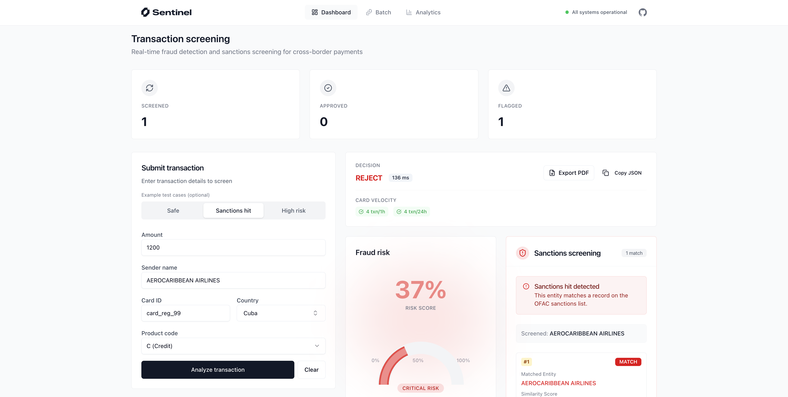

<div align="center" style="margin-bottom: 20px;">
  
</div>

## Overview

Sentinel is an open-source research case study for AI fraud detection and sanctions screening (using OFAC lists) for cross-border payments. It combines public datasets to detect CNP transaction fraud, screen against OFAC sanctions lists, and deliver explainable risk scores with sub-200ms latency.

## Features

- **CNP fraud detection** — Trained ML models for card-not-present transactions
- **OFAC sanctions screening** — Fuzzy matching against OFAC SDN and Consolidated lists
- **Explainable risk scores** — Real-time fraud risk with SHAP explanations; sub-200ms latency target
- **Notebooks** — EDA, model training, and sanctions screener build
- **FastAPI scoring service** — Real-time inference with Redis velocity features and PostgreSQL audit
- **Demo UI** — Transaction screening, batch requests, dashboard, PDF export

> [!WARNING]
> **For research/educational use only**
>
> Models trained on IEEE-CIS data are restricted to **non-commercial use**. Production deployments require retraining on proprietary or licensed datasets.

## Demo

[](https://youtu.be/NNC8YpdBePY)

**Live demo:** [sentinel.devbrew.ai](https://sentinel.devbrew.ai) · **Watch the full demo** [YouTube](https://youtu.be/NNC8YpdBePY)

The live app enables SHAP explanations for every transaction (~1–1.5s extra); the API alone reaches <50ms p95 when explainability is off.

**Full case study:** [devbrew.ai/case-studies/sentinel](https://www.devbrew.ai/case-studies/sentinel)

## Tech stack

- **Backend:** FastAPI, Python, LightGBM/XGBoost, Redis, PostgreSQL
- **Frontend:** Next.js, Tailwind CSS, Recharts
- **Hosting:** Render (API), Vercel (UI)

## Data sources

- **Fraud:** [IEEE-CIS e-commerce](https://www.kaggle.com/c/ieee-fraud-detection) (research only), [PaySim](https://www.kaggle.com/ntnu-testimon/paysim1) (open)
- **Sanctions:** [OFAC SDN and Consolidated Lists](https://sanctionslist.ofac.treas.gov/Home) (public domain)

## Repository structure

```
sentinel/
  ├── apps/
  │   ├── api/           # FastAPI scoring service
  │   └── web/           # Next.js demo UI
  ├── packages/
  │   ├── models/        # trained artifacts, ONNX exports
  │   └── compliance/    # sanctions screening
  ├── data_catalog/      # dataset download scripts + notes
  ├── docs/              # findings, roadmap, requirements
  └── notebooks/         # EDA + model training
```

Each app has its own README: [API](apps/api/README.md) · [Web](apps/web/README.md).

## Quickstart

### 1. Clone the repo

```bash
git clone https://github.com/devbrewai/sentinel.git
cd sentinel
```

### 2. Setup environment

**Using UV (recommended):**

```bash
curl -LsSf https://astral.sh/uv/install.sh | sh
uv sync
source .venv/bin/activate   # Linux/macOS
# .venv\Scripts\activate   # Windows
```

**Or using pip:**

```bash
python -m venv .venv
source .venv/bin/activate
uv pip install -e .
```

### 3. Run API and Web

**Option A — Run both together (recommended):**

```bash
make docker-up
cd apps/web && bun install   # once; see apps/web/README.md for auth/db if using login
make dev
```

`make dev` starts the API and frontend concurrently. API: http://localhost:8000 · Web: http://localhost:3000

**Option B — Run API only:**

```bash
make docker-up
make run-api
```

See [apps/api/README.md](apps/api/README.md) for environment variables and detailed API setup.

**Option C — Run frontend only:**

```bash
cd apps/web
bun install
```

See [apps/web/README.md](apps/web/README.md) for auth (Neon) and database setup. Then: copy `.env.example` to `.env.local`, run `bun run db:generate` and `bun run db:migrate`, then `bun run dev`.

Run `make help` for all commands.

## Development commands

**Make targets (from repo root):**

| Command | Description |
|---------|-------------|
| `make help` | Show all available commands |
| `make dev` | Start API + Web concurrently (requires docker-up) |
| `make docker-up` / `make docker-down` | Start or stop Redis & Postgres |
| `make run-api` | Start FastAPI server |
| `make run-web` | Start Next.js frontend |
| `make test` | Run API tests |
| `make test-web` | Run Next.js component tests |
| `make lint` | Run ruff linting |
| `make db-generate` | Generate Drizzle migrations |
| `make db-migrate` | Apply migrations to Neon auth DB |
| `make db-push` | Push schema directly (dev shortcut) |
| `make db-studio` | Open Drizzle Studio |

**API (from project root):** `uv sync`, activate venv, then `make run-api` or `PYTHONPATH=apps/api uvicorn src.main:app --reload`. Tests: `PYTHONPATH=apps/api pytest apps/api/tests -v`. Lint: `ruff check .`

**Web:** `cd apps/web`, `bun install`, then `bun run dev` / `bun run build` / `bun run lint` / `bun run test`. Auth DB: `bun run db:generate`, `bun run db:migrate`, `bun run db:push`, `bun run db:studio`.

**Notebooks:** Run Jupyter from project root: `jupyter notebook notebooks/`

Full details: [apps/api/README.md](apps/api/README.md), [apps/web/README.md](apps/web/README.md).

## Documentation

- **API:** [apps/api/README.md](apps/api/README.md) — environment, endpoints, local setup
- **Web:** [apps/web/README.md](apps/web/README.md) — auth, database, frontend setup
- **Research:** [docs/](docs/) and [case study](https://www.devbrew.ai/case-studies/sentinel) — phases, findings, requirements
- **AI/editor context:** [CLAUDE.md](CLAUDE.md) — codebase conventions and architecture for Claude Code

## Disclaimer

This repository is for **educational and research use only**. The IEEE-CIS dataset and any models trained on it are non-commercial; model artifacts here are for demonstration. Production use requires retraining on your own data. PaySim and OFAC data are subject to their respective terms. See [LICENSE](./LICENSE) and [NOTICE](./NOTICE) for full terms and dataset attributions.

## License

Apache 2.0 © Devbrew LLC. See [LICENSE](./LICENSE). [NOTICE](./NOTICE) includes dataset attributions.

## Contributing

Contributions are welcome. Open an issue for bugs or features; submit a PR following [CONTRIBUTING.md](./CONTRIBUTING.md).

## Contact

Questions? **hello@devbrew.ai**

We cannot provide commercial licensing for models trained on IEEE-CIS data. For production fraud detection, contact us about custom solutions with licensed data.
